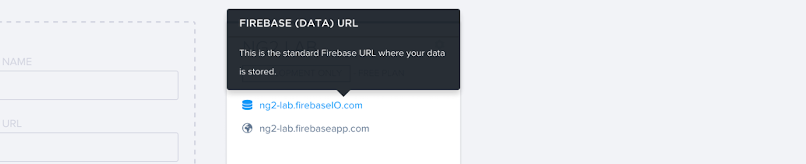
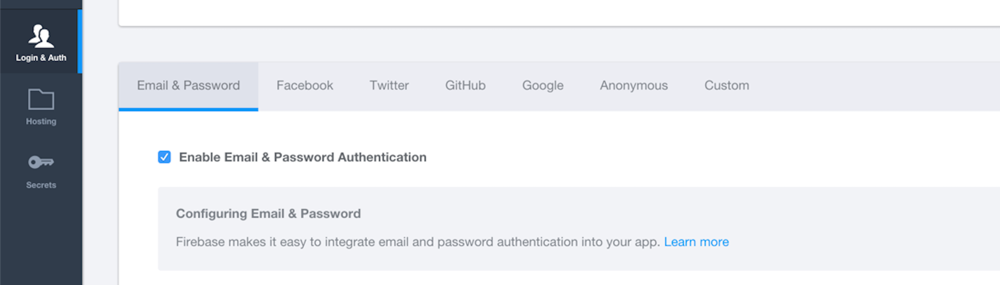

# Angular 2 Laboratory

[](https://travis-ci.org/rolandjitsu/ng2-lab)
[](https://gemnasium.com/rolandjitsu/ng2-lab)
[](https://gitter.im/rolandjitsu/ng2-lab?utm_source=badge&utm_medium=badge&utm_campaign=pr-badge&utm_content=badge)
> Playground for experimenting with some of the core features of [Angular 2.0](https://angular.io) and integration with other software and services.

This setup is using:
* [TypeScript](http://www.typescriptlang.org)
* [Core JS](https://github.com/zloirock/core-js) - necessary for browsers that haven't implemented any or some of the [ES6](http://es6-features.org) features used by Angular and this project
* [SystemJS](https://github.com/systemjs/systemjs) - loading the compiled (`.ts` -> `.js`) source files in the browser
* [Angular 2](http://angular.io/) - obviously (and all it's dependencies: [RxJS](https://github.com/ReactiveX/RxJS), [zone.js](https://github.com/angular/zone.js), etc.)
* [Firebase](https://firebase.com) - realtime store for the app's data, authentication and hosting provider
* [Protractor](https://angular.github.io/protractor) - e2e test framework
* [Karma](http://karma-runner.github.io)
* [Jasmine](http://jasmine.github.io) - assertion lib for the app unit tests
* [Travis CI](https://travis-ci.org) - used as both continuous integration and delivery service for the app
* [Saucelabs](https://saucelabs.com) - browser provider for running the app tests on the CI server
* [Gulp](http://gulpjs.com) - task runner (and some other dependencies used for some tasks)
* [BrowserSync](http://browsersync.io) - makes code refresh very easy

As package/typings managers:
* [Gemnasium](https://gemnasium.com) - keeps an eye on all the project dependecies version's
* [NPM](https://npmjs.com)
* [Bower](http://bower.io)
* [TSD](http://definitelytyped.org/tsd)

**Note**: Bear in mind that [Angular 2](https://angular.io) is not production ready yet, but you can keep an eye on it [here](http://splintercode.github.io/is-angular-2-ready), courtesy of [Cory Rylan](https://github.com/splintercode).


# Table of Contents

* [Setup](#setup)
* [Firebase Setup](#firebase-setup)
	* [Authentication](#authentication)
	* [Hosting](#hosting)
* [Travis CI Setup](#travis-ci-setup)
* [Development](#development)
	* [Info](#info)
	* [Running Tests](#running-tests)
	* [Other Tasks](#other-tasks)
* [Browser Support](#browser-support)
* [Learning Material](#learning-material)
* [Credits](#credits)


### Setup
---------
Make sure you have [Node](http://nodejs.org) (*if not already installed*) then clone this repo and setup the following tools on your machine using `npm install -g <package>`:
* [Bower](http://bower.io)
* [TSD](http://definitelytyped.org/tsd)
* [Gulp](http://gulpjs.com/)

**Note**: All the above tools are only necessary to install globally to avoid writing `./node_modules/.bin/<command>`/`$(npm bin)/<command>` every time you want to run a command. Users running OS X or Linux based systems (soon Windows as well) could also use tools like [direnv](http://direnv.net) to expose the local npm binaries using a `.envrc` file:
```shell
# Node Binaries
export PATH=$PATH:$PWD/node_modules/.bin
```
As a preference, I prefer not having anything installed globally and keep everything isolated per project.

After you have the above tools setup, install all runtime/dev dependencies by running:

```shell
$(node bin)/npm install
$(npm bin)/bower install
$(npm bin)/tsd install
```

**Note**: If you change any of the deps (remove/add) in either `bower.json`, `package.json` or `tsd.json`, make sure that you run the above commands again.

Now start the webserver and the build/watch processes (to watch for file changes) and the app will open in your default browser:

```shell
$(node bin)/npm start # `$(npm bin)/gulp serve`
```


### Firebase Setup
------------------
If you wish to have your own Firebase account used with this setup you have to change the `FIREBASE_APP_LINK` located in `src/app/services/firebase.ts` to your own Firebase app link:



#### Authentication

Furthermore, the authentication implementation uses Firebase as well, thus you need to follow a few steps if you decide to use your own Firebase account.
Enable **Email & Password** authentication from the **Login & Auth** tab in your app's Firebase dashboard.



Enable **Github** and **Google** auth from the same **Login & Auth** tab and follow the instructions in the [Github](https://www.firebase.com/docs/web/guide/login/github.html) and [Google](https://www.firebase.com/docs/web/guide/login/google.html) guides.

#### Hosting

Finally, if you want to use your own Firebase's [hosting](https://www.firebase.com/docs/hosting/quickstart.html) service, then you have to do a few things in order to make it work.
First make sure that you have ran `$(node bin)/npm install` so that the [firebase-tools](https://github.com/firebase/firebase-tools) dependency is installed. Then make sure that you are logged in the Firebase dashboard and run:

```shell
$(npm bin)/firebase login
```

And follow all the steps (a browser window will be opened so you can authenticate the client). Next you will need to get the token used for authentication when a deployment is done, do this by running:

```shell
$(npm bin)/firebase prefs:token
```

Copy the token and put it somewhere safe for further usage. Also change the `"firebase": "ng2-lab"` value from `firebase.json` to the name of you Firebase app.
Now you can deploy the app to you own Firebase app by running:

```shell
$(npm bin)/gulp deploy/hosting --token <your firebase token>
```

**Note**: If you use tools like [direnv](http://direnv.net/) you can export a `FIREBASE_TOKEN` which will be picked up by the `$(npm bin)/gulp deploy/hosting` so you won't need to provide the `--token` option every time you run the command.


### Travis CI Setup
-------------------
If you plan on using this setup with your own projects and you wish to setup Travis CI, then you must make sure of a couple of things in order to have everything working properly on the CI:

1. Setup and env variable `FIREBASE_TOKEN` containing the token you got from `$(npm bin)/firebase prefs:token` so that your deployments to firebase will work. If you do not use Firebase, skip this step. Also, you may want to encript the token if the source code is available for public, use the Travis [docs](https://docs.travis-ci.com/user/environment-variables/#Encrypted-Variables) to see how to do it.
2. Because of the nature of TSD, sometimes you will see some errors when it will try to install typings (about a Github rate limit), if that happens, you will also want to setup a `TSD_GITHUB_TOKEN` env variable which contains a [personal access token](https://help.github.com/articles/creating-an-access-token-for-command-line-use/) (should also be encrypted).
3. In case you use SauceLabs, set the env var `SAUCE_USERNAME` to your own username and create a new env variable `SAUCE_ACCESS_KEY` containing the access key you can get from the SauceLabs dashboard (read more about setting up SauceLabs with Travis [here](https://docs.travis-ci.com/user/sauce-connect/)).
4. If you do not use the deployment to Firebase, remove that step from `.travis.yml`.

Now, keep in mind that cloning this repo and continuing in the same project will give you some issues with Travis if you setup your own account. So I suggest you start out with a clean project and start git from scratch (`git init`), then copy over things from this project (obviously, do not include `.git` - not visible on most UNIX base systems).


### Development
---------------
Bellow you can find a couple of things to help understanding how this setup works and how to make it easier when developing on this app (or starting your own and use this as a guideline).

#### Info

When running the app (`$(npm bin)/gulp serve`) in a terminal window and running the unit tests (`$(npm bin)/gulp test/unit:continuous`) in watch mode in another at the same time (or vice versa), two web socket servers will be started in the background in order to communicate between the two processes.
The reason for the above is that when the app builds on file change the unit tests should not build again at the same time the app started the build (nor the other way around). Moreover, this will make sure to notify BrowserSync that a change happened and that it should reload the browser to reflect that change.

Furthermore, when running the `$(npm bin)/gulp serve` command a couple of things will happen:

1. everything will be distributed to a `dist` dir
2. dependencies will be copied to the dist folder
3. HTML and static assets will be copied to the dist folder
4. SASS will be compiled to CSS into the dist folder
5. the app and tests `.ts` files will be compiled (into the dist) and a build server will be started (the build server runs the `.ts` file compilation when a file change occurs)
2. a watcher for HTML, SASS and static assets will be started
5. [BrowserSync](http://browsersync.io) will open a browser window with the app running (on port `3000`, with the BS interface on port `3001` and the Weinre tool on `8080`)

The above info is important because you need to make sure that the following ports are always avaialble: `1729`, `6174`, `3000`, `3001`, `8080`.

#### Running Tests

Tests can be run selectively as it follows:

* `$(npm bin)/gulp lint`: runs [tslint](http://palantir.github.io/tslint/) and checks all `.ts` files according to the `tslint.json` rules file
* `$(npm bin)/gulp test/unit:continuous`: unit tests in a browser; runs in watch mode (i.e. watches the source files for changes and re-runs tests when files are updated)
* `$(npm bin)/gulp test/unit:single`: unit tests in a browser; runs in single run mode, meaning it will run once and it will not watch for file changes
* `$(npm bin)/gulp test/e2e:single`: e2e tests in a browser; runs in single run mode

And if you have a Saucelabse account, you can also run unit tests on some of the SL browsers provided in `browsers.config.js`. Just call `$(npm bin)/gulp test/unit:sauce --browsers=Chrome, Firefox, iOS9` (and whatever other browsers you wish) and make sure that you have the `SAUCE_USERNAME` and `SAUCE_ACCESS_KEY` env variables set. You can also pass the two env variables as options if you prefer it: `$(npm bin)/gulp test/unit:sauce --browsers=Chrome, Firefox --username=<your sauce username> --acessKey=<you sauce access key>`.

#### Other Tasks

If you run into caching issues or some other problems with the contents of the distribution folder, you could run the `$(npm bin)/gulp clean` task to remove it and then rebuild everything again.

If you just want to build everything, run `$(npm bin)/gulp build`.

And if you want to deploy the Firebase security rules, use `$(npm bin)/gulp deploy/rules`. Just make sure you provide the auth token either as an env variable (`FIREBASE_TOKEN`) or as an option (`--token`).

And of course to see what other tasks are available, run `$(npm bin)/gulp --tasks`.


### Browser Support
-------------------
Even though all source code is compiled/transpiled to ES5 and some [shims](https://github.com/zloirock/core-js) are provided, this app has no official indication of what browsers it supports (lack of enough unit/e2e tests).
Though, you can check out the browser support for [Angular 2](https://github.com/angular-class/awesome-angular2#current-browser-support-for-angular-2) and assume that the app will work where Angular 2 works.


### Learning Material
---------------------
* [Angular Docs](https://angular.io)
* [Routing](http://blog.thoughtram.io/angularjs/2015/02/19/futuristic-routing-in-angular.html)
* [Template Syntax](http://victorsavkin.com/post/119943127151/angular-2-template-syntax)
* [Forms](https://ngforms.firebaseapp.com)
* [DI](http://blog.thoughtram.io/angular/2015/05/18/dependency-injection-in-angular-2.html)
* [Shadow DOM](https://developer.mozilla.org/en-US/docs/Web/Web_Components/Shadow_DOM)
* [Angular 2 Education](https://github.com/timjacobi/angular2-education)
* [Awsome Angular 2](https://github.com/angular-class/awesome-angular2)


### Credits
-----------
In the making of this simple app, I have made use of whatever resources I could find out there (since the docs on some of the Angular 2 features usage are not that extensive and it's constantly changing for the moment), thus it's worth mentioning that the following projects have served as inspiration and help:

* [ng2-play](https://github.com/pkozlowski-opensource/ng2-play)
* [angular2-webpack-starter](https://github.com/angular-class/angular2-webpack-starter)
* [angular2-authentication-sample](https://github.com/auth0/angular2-authentication-sample)
* [ng2do](https://github.com/davideast/ng2do)